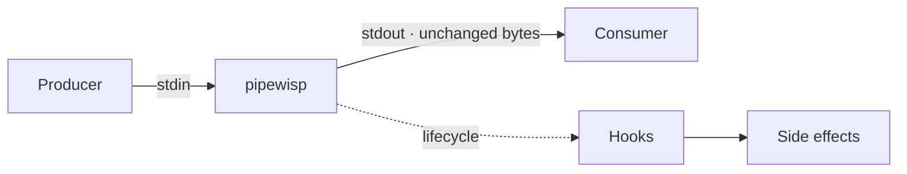
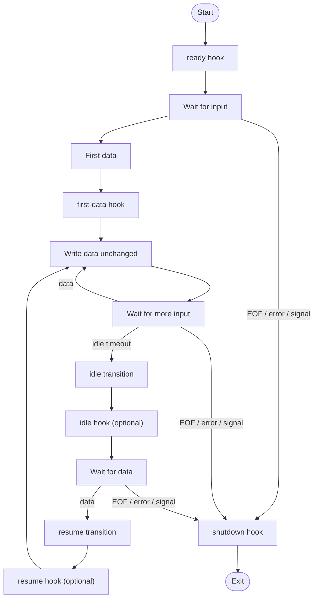

# pipewisp

```text
             ~
          ~
       ~
──────╂────────────────▶
      │
   pipewisp
      ✦
```

**Pass the stream through. Let lifecycle side effects drift away.**

`pipewisp` passes standard input to standard output byte-for-byte while running
optional commands at stream lifecycle events. It is intended for inserting
synchronous side effects into a Unix or Windows pipe without transforming the
stream.

## Concept



The solid path is the data path: stdout contains only the original stream bytes
in their original order. Hooks branch from lifecycle events and run
synchronously; their stdout and stderr are both directed to pipewisp's stderr.

## Install and build

From a checkout:

```sh
go install ./cmd/pipewisp
go build -o pipewisp ./cmd/pipewisp
```

The module can also be installed directly once published:

```sh
go install github.com/zaubermaerchen/pipewisp/cmd/pipewisp@latest
```

## Download releases

Tagged binaries are available from the repository's
[GitHub Releases](https://github.com/zaubermaerchen/pipewisp/releases). Each
release provides these six archives: `linux_amd64`, `linux_arm64`,
`darwin_amd64`, `darwin_arm64`, `windows_amd64`, and `windows_arm64`.

Download the archive for your platform and verify it with the accompanying
checksums file before extracting it. For example, on Linux:

```sh
archive=pipewisp_v0.1.0_linux_amd64.tar.gz
grep -F -- "  $archive" SHA256SUMS > "$archive.sha256" || exit 1
sha256sum -c "$archive.sha256"
```

On macOS, replace the final command with
`shasum -a 256 -c "$archive.sha256"`. On Windows
PowerShell:

```powershell
$archive = "pipewisp_v0.1.0_windows_amd64.zip"
$expected = (Get-Content SHA256SUMS | Where-Object { $_ -like "*  $archive" }).Split()[0]
$actual = (Get-FileHash -Algorithm SHA256 $archive).Hash.ToLowerInvariant()
if ($actual -ne $expected) { throw "checksum mismatch: $archive" }
```

## Lifecycle



Each hook shown is optional, and the idle/resume path is active only when idle
mode is configured. `idle transition` and `resume transition` are lifecycle
events; their corresponding hooks are optional. Hooks run synchronously.
Failures are strict by default,
and `--hook-timeout` starts a fresh timeout window for each invocation. With
`--ignore-hook-errors`, ordinary hook command failures and hook timeouts are
still diagnosed but do not by themselves stop an otherwise continuing
lifecycle or change its final status. Handled signals, stream I/O failures,
and CLI/configuration errors are outside that policy. The detailed Usage and
Exit status sections remain authoritative for exact behavior and precedence.

## Usage

```text
pipewisp --version
pipewisp [--name NAME] [--verbose] [--on-ready COMMAND] [--on-first-data COMMAND] [--on-shutdown COMMAND] [--idle DURATION] [--on-idle COMMAND] [--on-resume COMMAND] [--hook-timeout DURATION] [--ignore-hook-errors]
```

Each hook option is optional and may be specified at most once. `--idle` is a
Go duration such as `250ms` or `2s`; it must be positive and must be used with
at least one of `--verbose`, `--on-idle`, or `--on-resume`. The separated and
equals forms are supported for options that take values. `--hook-timeout` is a
positive Go duration that bounds each lifecycle hook invocation (`--on-ready`,
`--on-first-data`, `--on-idle`, `--on-resume`, and `--on-shutdown`). A new
timeout window starts for every invocation; when the option is omitted, hooks
have no time limit. `--ignore-hook-errors` is a value-less opt-in flag; without
it, hook failures remain strict and affect processing or final status as
described below. `--verbose` is also value-less and writes lifecycle and hook
diagnostics to stderr. It works without hooks and, when combined with `--idle`,
enables passive idle/resume observation without requiring either idle hook.

`--name` assigns a human-readable identity to this pipewisp instance. Runtime
diagnostics use `pipewisp[NAME]:` instead of `pipewisp:`, but the option does
not enable verbose mode, otherwise add diagnostics, or enable idle mode by
itself. Both `--name NAME` and
`--name=NAME` are accepted. A name beginning with `-` must use the equals form,
for example `--name=-relay`; in the separated form, a token beginning with `-`
is treated as a missing value. Duplicate use, including mixed forms, is an
error.

Names must be valid UTF-8 and contain at least one non-whitespace Unicode code
point. Unicode control characters (`Cc`), line and paragraph separators (`Zl`
and `Zp`), Unicode bidi control characters (U+061C, U+200E–U+200F,
U+202A–U+202E, and U+2066–U+2069), and `[` or `]` are rejected. Other Unicode
text is preserved without normalization, including embedded whitespace,
Japanese text, emoji, and zero-width-joiner emoji sequences. There is no
pipewisp-specific length limit beyond the operating system's argument limit.

Only the exact `--verbose` token is accepted. Equals forms such as
`--verbose=true` and `--verbose=` are unknown options, a following token in
`--verbose false` remains an invalid positional argument, and duplicate use is
an error. The `-v` short form is not supported.

`--version` prints the build version (or `devel`) and exits without reading
stdin or running hooks; it must be used alone. Likewise, `-h` or `--help` must
be used alone, so combining either standalone option with `--verbose` is an
error.

Pull-request release artifacts use `snapshot`, so their output may be
`pipewisp snapshot`.

```sh
pipewisp --version
producer | pipewisp
producer | pipewisp --on-ready 'printf "started\\n"' --on-shutdown 'printf "stopped\\n"'
producer | pipewisp --on-first-data 'printf "observed\\n"'
producer | pipewisp --on-ready='prepare' --on-shutdown='cleanup'
producer | pipewisp --on-ready='prepare' --on-first-data='observe' --on-shutdown='cleanup'
producer | pipewisp --idle 2s --on-idle 'printf "idle\\n"' --on-resume 'printf "active\\n"'
producer | pipewisp --idle=250ms --on-idle='notify-idle'
producer | pipewisp --verbose --idle 2s
producer | pipewisp --name relay --verbose --idle 2s
producer | pipewisp --hook-timeout=5s --on-ready 'prepare' --on-shutdown 'cleanup'
producer | pipewisp --ignore-hook-errors --on-ready 'notify-start' --on-shutdown 'notify-stop'
producer | pipewisp --verbose
producer | pipewisp --name relay --verbose | pipewisp --name notify --verbose
pipewisp --help
```

Duplicate options, unknown options, missing or empty commands or durations,
invalid names, non-positive or invalid durations, invalid idle configurations,
and positional arguments are errors. `--idle` without `--verbose`, `--on-idle`,
or `--on-resume` fails with `--idle requires --verbose, --on-idle, or
--on-resume`. CLI parse and validation
diagnostics retain the ordinary `pipewisp:` prefix even when a valid `--name`
appears elsewhere in the arguments. `--on-first-data` is independent of
`--on-ready`, `--on-shutdown`, and idle mode; all lifecycle options may be used
together. The former `--on` and `--off` forms are not aliases and are rejected
as unknown options.
`--help` prints usage and exits successfully.

Commands are executed synchronously in this order:

1. `--on-ready`, if present
2. read the first input data bytes, if any
3. `--on-first-data`, if present, immediately after those bytes are observed
4. write those first bytes and copy the remaining stdin-to-stdout stream
5. `--on-shutdown`, if present, after EOF, an I/O error, or a handled signal

The first-data command runs exactly once and only when the input contains at
least one byte. It completes before the first input byte is written to stdout;
the input stream is otherwise preserved byte-for-byte and in order. Empty
input and EOF without data do not run the first-data command.

With idle mode enabled, the timer starts after the first non-empty chunk has
finished writing to stdout, while pipewisp waits for the next read. It is
paused during stdout writes. Each non-empty read while active resets the timer.
When the timer expires, `--on-idle` runs once for that idle interval, if
configured. The first non-empty read after an idle interval runs `--on-resume`,
if configured, before that data is written to stdout. When `--on-first-data` is
also configured, the first-data hook runs before any resume hook and the initial
data is not treated as a resume transition. EOF and signals do not trigger
resume.

On Unix, hooks run as `/bin/sh -c COMMAND`. On Windows, they run as
`cmd.exe /C COMMAND`. Hook stdin is isolated from the passthrough stream: it
is connected to an empty/null input. Hook stdout and stderr are both sent to
pipewisp's stderr; stdout contains passthrough data only. If a hook exceeds
`--hook-timeout`, pipewisp terminates the directly-started hook process, waits
for it to be reaped, reports the timeout on stderr, and applies the normal
hook-failure policy. A handled SIGINT or SIGTERM stops a running hook
immediately instead of waiting for its timeout; the signal status remains the
final status and the `on-shutdown` context keeps the original completion reason.

With `--ignore-hook-errors`, command failures and hook timeouts are still
reported to stderr but do not by themselves stop an otherwise continuing
lifecycle or change its final status. The policy applies uniformly to
`ready`, `first-data`, `idle`, `resume`, and `shutdown`. In particular, a failed first-data
hook still preserves its already-read bytes and then continues reading later
input, and an ignored `shutdown` failure preserves the result that caused cleanup
to run. The option does not ignore handled signals, stdin read failures, stdout
write failures (including broken pipe), or CLI/configuration errors.

## Verbose diagnostics

`--verbose` provides a human-readable view of lifecycle transitions and
synchronous hook execution. All records go to stderr; passthrough stdout still
contains only the original bytes, unchanged and in order. Lifecycle events are
reported whether or not their corresponding hook is configured:

```text
pipewisp: type=event event=ready bytes=0 elapsed_ms=0
pipewisp: type=event event=first-data bytes=0 elapsed_ms=125
pipewisp: type=event event=idle bytes=4096 elapsed_ms=2134
pipewisp: type=event event=resume bytes=4096 elapsed_ms=5271
pipewisp: type=event event=shutdown reason=eof bytes=8192 elapsed_ms=6140
```

When `--name relay` is configured, every pipewisp-generated runtime record and
error uses the named source prefix, for example:

```text
pipewisp[relay]: type=event event=idle bytes=4096 elapsed_ms=2134
pipewisp[relay]: on-idle hook failed: exit status 1
```

Without `--name`, the existing `pipewisp:` prefix is unchanged. Hook stdout and
stderr are never given either prefix; they retain the forwarding behavior
described below.

Combining `--verbose` with `--idle` enables passive idle/resume observation;
neither idle hook is required. Idle and resume events are reported when they
occur, regardless of whether their corresponding hooks are configured. If
`--on-idle` is absent, an idle transition produces no `type=hook` records or
hook command output; if `--on-resume` is absent, a resume transition produces
no `type=hook` records or hook command output. Other configured lifecycle hooks
retain their existing behavior. A shutdown record includes `reason=eof`,
`reason=signal`, `reason=broken-pipe`, or `reason=io-error` when that existing
lifecycle reason applies; otherwise the field is omitted.

When a hook is configured for an event, stderr follows this logical order:

1. the lifecycle event record;
2. the hook `state=start` record;
3. stdout and stderr forwarded from the hook, in unspecified relative order;
4. exactly one hook terminal record; and
5. the existing hook-failure diagnostic, if the hook failed.

Representative hook records are:

```text
pipewisp: type=hook event=idle state=start
pipewisp: type=hook event=idle state=exit exit_code=0 duration_ms=6
pipewisp: type=hook event=idle state=timeout duration_ms=5003
pipewisp: type=hook event=idle state=interrupted signal=SIGTERM duration_ms=721
pipewisp: type=hook event=idle state=error phase=start duration_ms=0
pipewisp: type=hook event=idle state=exit signal=SIGTERM duration_ms=6
```

`exit` describes normal and non-zero process exits, and also a hook process
that independently exits because of a signal. `timeout` means the configured
hook deadline was observed. `interrupted` is reserved for a still-running hook
that pipewisp stopped after accepting a handled signal. `error phase=start`
means the hook process could not be started. Signal fields use canonical
uppercase names such as `SIGINT`, `SIGTERM`, and `SIGPIPE`; an unknown numeric
signal is reported as `signal=unknown signal_number=N`.

Hook `duration_ms` is elapsed monotonic whole milliseconds, truncated rather
than rounded. Measurement starts immediately before the process start attempt,
after the start record has been written, and ends after completion handling and
process reaping. It therefore includes `Wait`, timeout termination, and reap
time, can exceed a configured timeout, and excludes the terminal-record write.
A process-start failure is explicitly reported as zero.

Hook stdout and stderr are forwarded unchanged. If their combined output is
non-empty and does not end in a newline, verbose mode writes exactly one
separating newline before the hook terminal record. It adds no separator after
empty or already newline-terminated output. This separator exists only in
verbose mode.

Within v0.3, records use the field order shown above: lifecycle records use
`type`, `event`, optional shutdown `reason`, `bytes`, `elapsed_ms`; hook records
use `type`, `event`, `state`, then the outcome fields shown for that state.
Optional fields are omitted. This deterministic order makes output convenient
for humans and simple filtering, but verbose output is not a stable
machine-readable compatibility interface. Later releases may change its
fields, order, or vocabulary.

Pipewisp-generated verbose writes are synchronous and best-effort. A write
error or short write does not produce a recursive diagnostic or change
passthrough data, lifecycle decisions, hook policy, or exit status. A slow or
blocked stderr can nevertheless delay hooks, stream processing, signal
observation, and later lifecycle snapshots, so verbose mode does not promise
unchanged timing or throughput.

On the normal copy path, verbose mode observes the first non-empty read before
writing that data so it can report `first-data` at the correct boundary. This
may disable source `WriterTo`, destination `ReaderFrom`, or operating-system
zero-copy fast paths, and may change internal read/write counts and chunking.
It still preserves output bytes and order, successful-byte accounting, error
classification, lifecycle decisions, policy, and status. Without verbose mode
and without a first-data hook, the existing fast path remains available.

Verbose records do not alter `--ignore-hook-errors` or any existing lifecycle
or exit-status rule. They deliberately exclude passthrough contents, individual
reads and writes, hook command strings, complete hook environments, wall-clock
timestamps, process IDs, and implementation details.

Hooks inherit pipewisp's environment. For each hook, pipewisp replaces the
following variables with a lifecycle snapshot (taken immediately before the
hook, except that `shutdown` is frozen when stream completion is determined):

| Variable | Value |
| --- | --- |
| `PIPEWISP_EVENT` | `ready`, `first-data`, `idle`, `resume`, or `shutdown` |
| `PIPEWISP_BYTES` | Cumulative bytes successfully written to passthrough stdout, including partial writes. |
| `PIPEWISP_DURATION_MILLISECONDS` | Elapsed whole milliseconds since the lifecycle started. The `ready` hook always receives `0`. |
| `PIPEWISP_REASON` | Set only for `shutdown`: `eof`, `signal`, `broken-pipe`, or `io-error`. It is omitted for other hooks and when no `shutdown` reason applies. |

Unknown `PIPEWISP_*` variables and ordinary variables such as `PATH` are
preserved from the parent environment. Hook execution time is included in
later snapshots, but never changes a context already delivered to a running
hook. The `shutdown` context is snapshotted when the stream completion outcome is
determined, before completion diagnostics and cleanup begin. A signal arriving
later can change pipewisp's final exit status, but does not change the `shutdown`
event, reason, byte count, or duration; cleanup time is not added to that
snapshot. Ignoring a hook failure does not create or rewrite a lifecycle
completion reason.

`--name` does not add, replace, or remove `PIPEWISP_NAME` in hook environments.
If the parent environment already defines `PIPEWISP_NAME`, hooks inherit that
value unchanged; it is not replaced with the configured instance name.

All lifecycle hook options execute their command through a shell. Do not pass
untrusted or unsanitized command strings: shell metacharacters have their
normal platform-specific meaning.

## Exit status

| Cause | Status | Behavior |
| --- | ---: | --- |
| Normal EOF | 0 | Run `--on-shutdown`, if present. |
| Downstream broken pipe (EPIPE) | 0 | Treat downstream closure as normal; run `--on-shutdown` and suppress the ordinary broken-pipe error diagnostic. With `--verbose`, emit the shutdown event with `reason=broken-pipe`. |
| Other copy/I/O error | 1 | Report the error and run `--on-shutdown`, if present. |
| `--on-ready` failure | 1 | Report the hook failure; do not copy data or run `--on-shutdown`. With `--ignore-hook-errors`, continue normally instead. |
| `--on-first-data` failure | 1 | Report the hook failure, write the already-read first bytes unchanged, stop before reading more input, and run `--on-shutdown`, if present. With `--ignore-hook-errors`, continue reading after those bytes. |
| `--on-idle` or `--on-resume` failure | 1 | Report the hook failure, continue copying, and run `--on-shutdown`, if present. With `--ignore-hook-errors`, the failure does not affect final status. |
| `--on-shutdown` failure | 1 | Report the hook failure. With `--ignore-hook-errors`, preserve the pre-existing lifecycle result. |
| SIGINT / Ctrl+C | 130 | Run `--on-shutdown` synchronously; this signal status wins if `--on-shutdown` also fails. |
| SIGTERM (Unix) | 143 | Run `--on-shutdown` synchronously; this signal status wins if `--on-shutdown` also fails. |

On Unix, pipewisp ignores SIGPIPE so a closed downstream is reported as an
EPIPE copy result instead of terminating the process before cleanup can run.
EPIPE only describes pipewisp's downstream; it cannot keep a consumer alive,
reopen a closed pipe, or determine how an upstream producer reacts.

## Operational limits

The interface has no configuration files, multiple hooks of the same lifecycle
kind, or general hook-policy framework. The `-v` short form remains unsupported.
Cleanup cannot run after
SIGKILL, an unrecoverable process crash, or power loss, because those
conditions do not allow a user-space hook to execute.

## Design principles

For the rationale behind pipewisp's intentionally small, composable core, see
the [Design Principles](https://github.com/zaubermaerchen/pipewisp/wiki/Design-Principles)
Wiki page.
